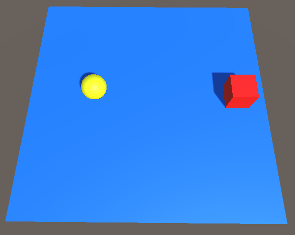
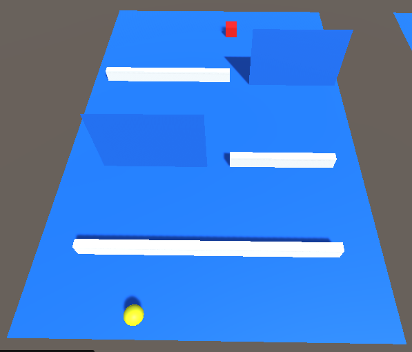
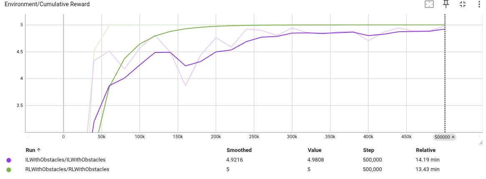

# ML Agents: RL vs IL

## Tools & Frameworks

**[Unity ML-Agents Toolkit](https://github.com/Unity-Technologies/ml-agents)**: used to train agents with Reinforcement Learning and Imitation Learning.

**Reinforcement Learning (RL)**: agent learns based on a reward/penalty system.

**Imitation Learning (IL)**: agent learns from player demonstrations to achieve faster training.

## Scenarios & Parameters
<!--
**Basic Environment:** A sphere (agent) learns to reach the cube (target).

    
     <em>Figure 1: Agent (sphere) learns to reach the target (cube) using RL and IL.</em>

-->
**Environment:** A sphere (agent) learns to reach the cube (target) while avoiding obstacles.

    
     <em>Figure 1: Agent (sphere) learns to reach the target (cube) with obstacles using RL and IL.</em>

### RL Setup
- Rewards:
  - +5 for reaching the target.
- Penalties:
  - -1 if the agent falls off the platform.
  - -0.01 if the agent hits the wall.

### IL Setup
- **Demonstrations**: Recorded player actions provided as training data.
- **Behavioral Cloning (BC)**: Initial supervised learning stage where the agent directly imitates the demonstrations.
- **GAIL**: Adversarial training that encourages the agent to generate behaviors indistinguishable from the demonstrations.
- **RL Fine-tuning**: PPO with extrinsic rewards is applied in parallel, allowing the agent to refine its policy beyond the demonstrations.

### Experiments & Results

    
     <em>Figure 2: The cumulative reward graph of RL and IL in the environment shown in Figure 1.</em>

**Reinforcement Learning (RL)**:    
- The agent successfully learned to reach the target after a few hundred steps.
- Training was relatively stable and consistent.

**Imitation Learning (IL)**:
- Expected to achieve faster results, but in practice underperformed compared to RL.
- Likely due to insufficient demonstrations and untuned parameters.

### Next steps: 
- Parameter tuning
- More complex environments

## How to run:
mlagents-learn config/CONFIG_NAME.yaml --force --run-id=RUN_ID

mlagents-learn config/RLWithObstacles.yaml --force --run-id=RLWithObstacles

**see results**:
tensorboard --logdir results --port 6006

